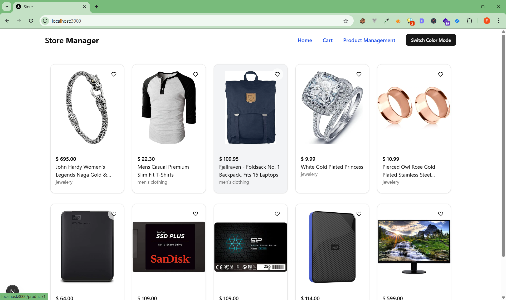
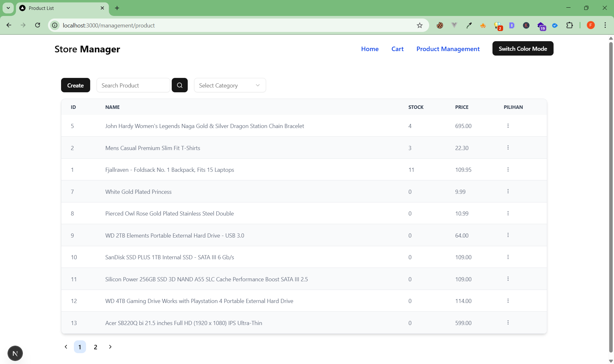
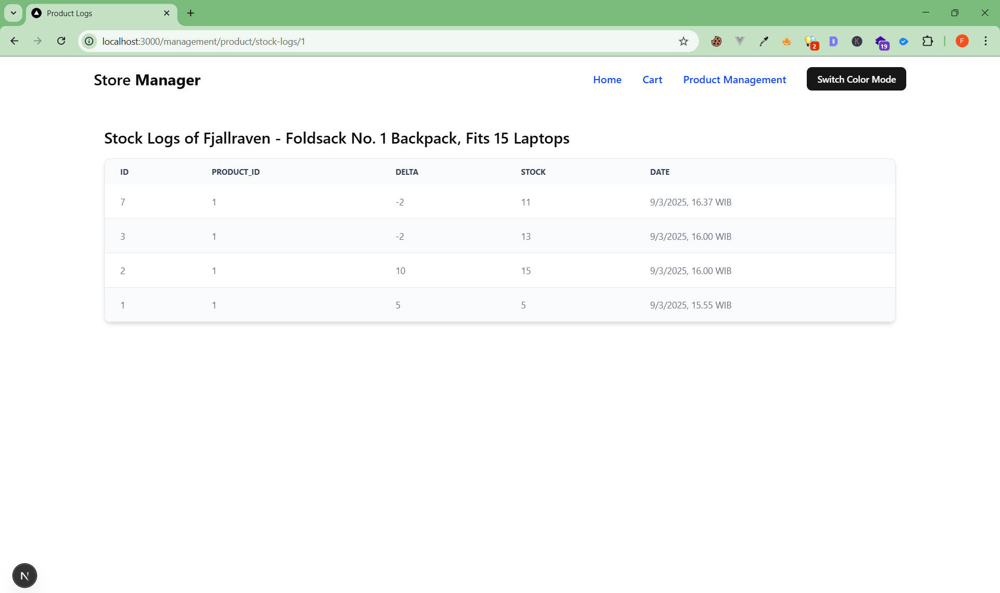

# JUBELIO Hiring Test Asignment

## How To Run
### Using Docker
```sh
docker compose up
```

### manual
- Install dependencies
```
npm install
```
- Setup db connection
```
cp ./backend/.env.dev ./backend/.env
```
- Run migration
```
npm run migration:latest -w backend
```
- Run Seeder
```
npm run seed:run -w backend
```
- Setup Frontend Emv File
```
cp ./frontend/env.example ./frontend/.env.local
```
- Run Project
```
npm run dev
```
- Open apps at http://localhost:3000

## Screenshot
### Product List Page

### Cart Page

### Admin Page

### Admin Stock Logs Page
